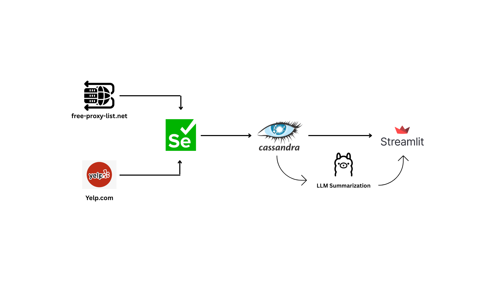
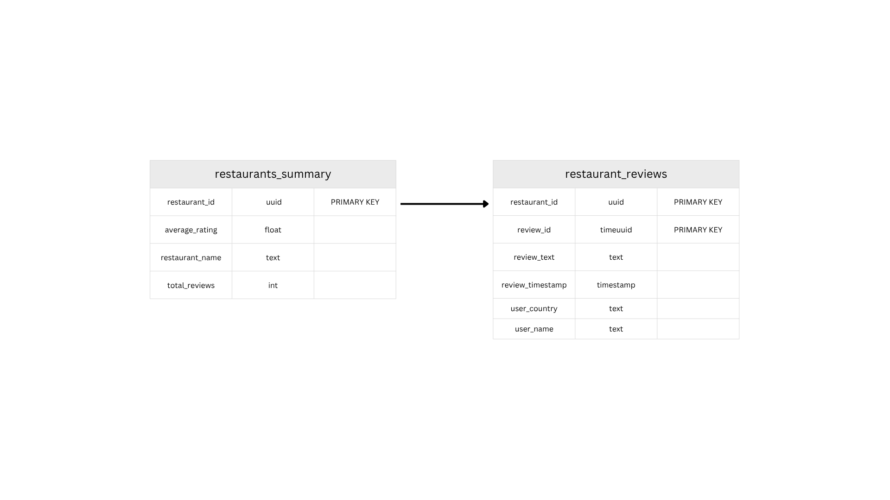

# Yelp-Restaurant-Data-Pipeline-AI-Powered-Analytics-Dashboard

This project delivers a robust, end-to-end data engineering and analytics solution designed to extract, store, analyze, and visualize restaurant data and customer reviews from Yelp. Beyond basic data collection, it integrates advanced techniques like dynamic proxy management for resilient scraping and Large Language Model (LLM) powered summarization to distill insights from customer feedback. The entire system is orchestrated through a Python-based pipeline and presented via an interactive Streamlit dashboard.

And this is the workflow for this project

The project is structured into several modular components that work together to form a complete data pipeline:

  1. Web Scraping (Selenium & Proxy Management):

      - Initiates a browser session (Chrome in headless mode) using Selenium WebDriver.

      - Utilizes a custom ProxyScrape module to dynamically fetch and validate active proxy servers from free-proxy-list.net. This ensures resilience against IP blocking and enhances scraping efficiency.

      - Navigates Yelp, applies location-based filters (e.g., Paris), and meticulously extracts restaurant details (name, average rating, total reviews) and associated customer reviews (user name, country, review         text).

      - Handles pagination for both restaurant listings and individual review pages.

  2. Data Storage (Apache Cassandra):

      - Scraped structured and unstructured data is persisted in a NoSQL Cassandra database.

      - Two tables are designed for optimal querying:

        - restaurants_summary: Stores high-level restaurant information, with restaurant_id as the primary key.

        - restaurant_reviews: Stores individual review details, linked to restaurant_id and using review_id (a timeuuid) as a clustering key, allowing for efficient time-series querying of reviews for a given               restaurant.

     - Data insertion is optimized using Cassandra Batch Statements for efficient bulk loading of reviews.
     
